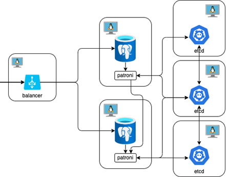
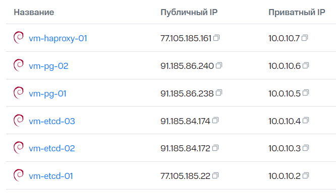
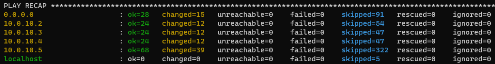

# sre-mts-task
ДОМАШНЕЕ ЗАДАНИЕ ПО МОДУЛЮ 2
```
namespace: sre-cource-student-74
user: student74
```

## Создание ВМ



Для решения поставленной задачи было создано 6 вирутальных машин на базе Debian 11



## Настройка ansible
Пример, который был взят за основу - https://github.com/vitabaks/postgresql_cluster




## Конфигурация БД

Файл для миграции sql лежит в образе - /app/Migrations/init.sql

Подключаюсь к БД по адресу балансировщика, порт 5000
Создаю БД weather и выполняю файл миграции:

```
create table if not exists public.cities
(
    id   bigserial,
    name varchar(255)
);

create table if not exists public.forecast
(
    id          bigserial,
    "cityId"    bigint,
    "dateTime"  bigint,
    temperature integer,
    summary     text
);
```


