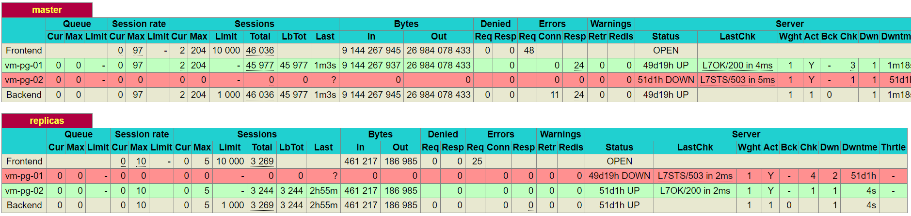
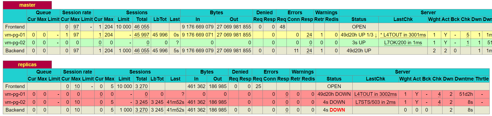
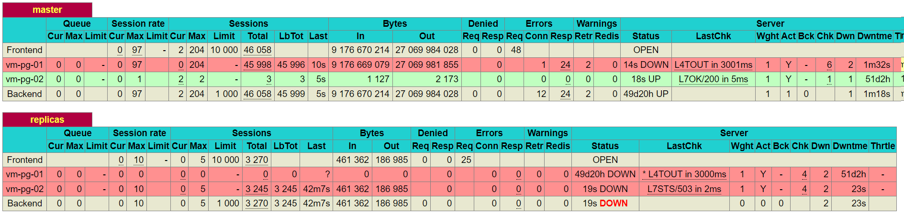
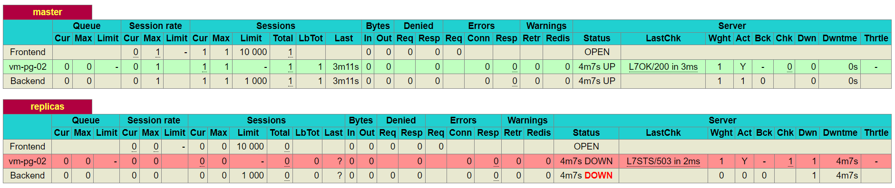
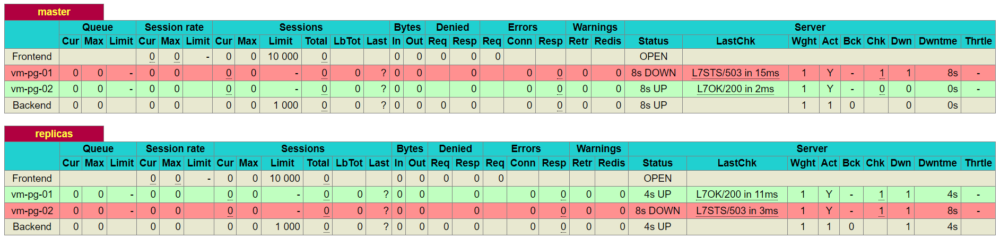
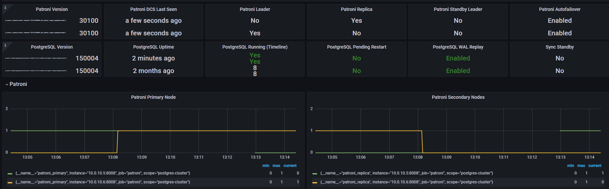

# Домашнее задание №4

*Chaos engineering предоставляет отличные возможности для тестирования не только стойкости системы к сбоям, но и эффективности ее мониторинга и оповещений. Применение chaos engineering в данном контексте позволяет проверить, как система реагирует на сбои и насколько эффективно она уведомляет о них.*  

## 1. Отключение узла: 
- Описание эксперимента: Планово остановить один из узлов кластера, чтобы проверить процедуру переключения ролей (failover). - Анализировать время, необходимое для восстановления и как система выбирает новый Master узел (и есть ли вообще там стратегия выбора?).  
Полное отключение(выключение ВМ) ноды postgre с ролью мастер:  

В моём случае стратегии выбора нет, т.е. если "отваливается" мастер, то происходит перевыборы этой роли на доступной ноде, как только становится доступным - его роль устанавливается как реплика.

- Ожидаемые результаты: Ожидание изменение роли оставшейя ноды с реплики на мастер 

- Реальные результаты: Что произошло на самом деле в ходе эксперимента.
Логи, метрики и выводы систем мониторинга и логирования.  

Для мониторинга состояния использую средства HAproxy, допустные на 7000 порту (IP:7000/stat)  

Первоначальное состояние системы:  


После отключения ноды:  


pg_02 получила статус мастера:  


через некоторое время pg_01 совсем пропала из списка:  


После включения ноды pg_01 получила роль реплики, что является ожидаемым результатом:  


В графана на дашборде с patroni можно наблюдать эти события (переключение ролей):  


- Анализ результатов: Система отработала штатно, каких-то отклонений в работе я не обнаружил.  


## 2. Имитация частичной потери сети: 
- Описание эксперимента: Использовать инструменты для имитации потери пакетов или разрыва TCP-соединений между узлами. Цель — проверить, насколько хорошо система справляется с временной недоступностью узлов и как быстро восстанавливается репликация.

- Ожидаемые результаты: Описание ожидаемого поведения системы в ответ
на условия эксперимента.

- Реальные результаты: Что произошло на самом деле в ходе эксперимента.
Логи, метрики и выводы систем мониторинга и логирования.

- Анализ результатов: Подробное сравнение ожидаемых и реальных
результатов. - Обсуждение возможных причин отклонений.


## 3. Высокая нагрузка на CPU или I/O: 
- Описание эксперимента: Запустить процессы, которые создают высокую нагрузку на CPU или дисковую подсистему одного из узлов кластера, чтобы проверить, как это влияет на производительность кластера в целом и на работу Patroni.

  Для имитации нагрузки буду использовать утилиту **stress-ng**.

  ``` stress-ng —-cpu 0 --cpu-method matrixprod -t 360s ```

- Ожидаемые результаты: Штатная работа кластера patroni, возможны задержки в обработке запросов из-за нехватки процессорного времени

- Реальные результаты: Что произошло на самом деле в ходе эксперимента.
Логи, метрики и выводы систем мониторинга и логирования.

- Анализ результатов: Подробное сравнение ожидаемых и реальных
результатов. - Обсуждение возможных причин отклонений.


## 4. Тестирование систем мониторинга и оповещения: 
- Описание эксперимента: С помощью chaos engineering можно также проверить, насколько эффективны системы мониторинга и оповещения. Например, можно
искусственно вызвать отказ, который должен быть зарегистрирован системой мониторинга, и убедиться, что оповещения доставляются вовремя ?

- Ожидаемые результаты: Описание ожидаемого поведения системы в ответ
на условия эксперимента.

- Реальные результаты: Что произошло на самом деле в ходе эксперимента.
Логи, метрики и выводы систем мониторинга и логирования.

- Анализ результатов: Подробное сравнение ожидаемых и реальных результатов. - Обсуждение возможных причин отклонений.
