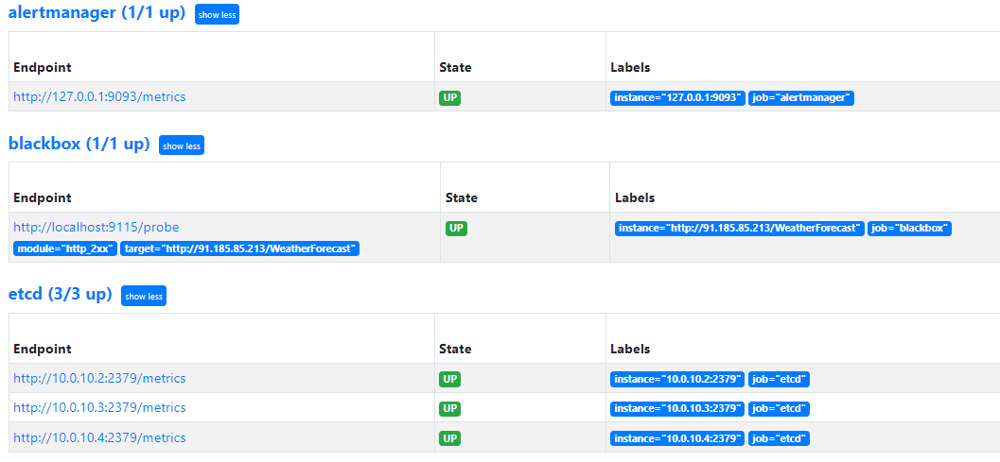
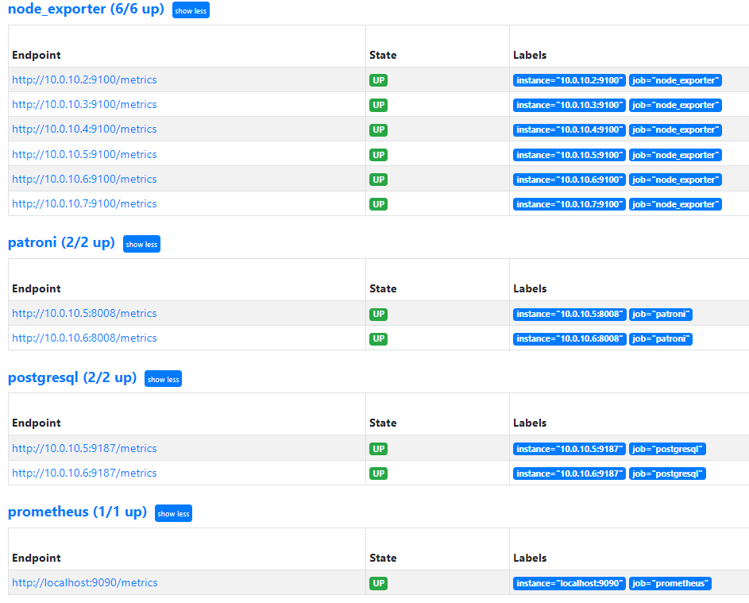
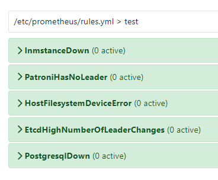
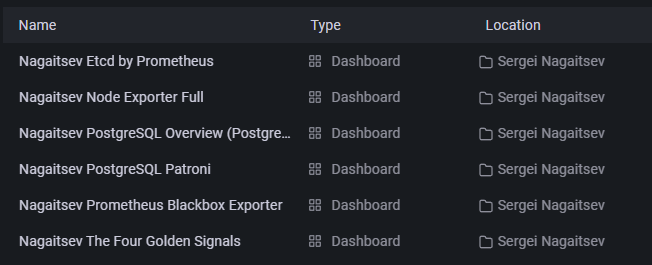
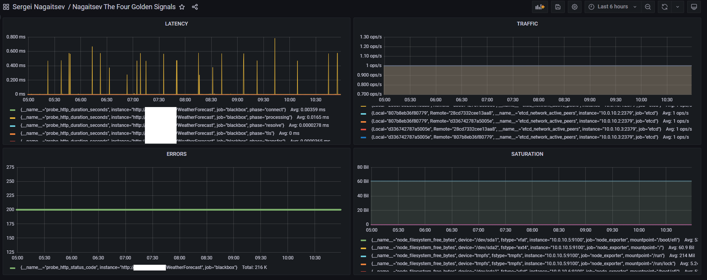

# ДОМАШНЕЕ ЗАДАНИЕ ПО МОНИТОРИНГУ

```
namespace: sre-cource-student-74
user: student74
```
## Задачи

1.Развернуть Prometheus на виртуальной машине  
2.Настроить сбор метрик с PostgreSQL, Patroniи etcd  
3.Настроить сбор black box мониторинг API демоприложения  
4.Настроить сбор метрик ОС с виртуальных машин  
5.Создать в Grafanaворганизации Main Org:  

- 1.Каталог для дашбордовсо своим ФИ латиницей  
- 2.Источник данных для своего Prometheus(в названии ФИ латиницей)  
- 3.Создать в своем каталоге типовые дашбордыдля компонент из п2-п4  
- 4.Создать в совемкаталоге дашборд с 4 золотыми сигналамидля APIдемоприложения по данным метрик ingressk8s  

6.Настроить в Prometheus алертына 4 золотых сигнала мониторинга  


## Установка компонентов

Для установки компонентов мониторинга я использовал ansible. Все используемые роли находятся в разделе ansible/roles

За основу взял роли (prometheus, node_exporter, black_box_exporter) с этого ресурса https://github.com/MiteshSharma/PrometheusWithAnsible. 

Роль alertmanager добавлена из репозитория https://github.com/prometheus-community/ansible/tree/main/roles/alertmanager  

Роль postgresexporter добавлена отсюда - https://github.com/ome/ansible-role-prometheus-postgres

У patroni и etcd есть свои собственные экспортеры "из коробки", буду использовать их, добавив в /etc/prometheus/prometheus.conf 

```
  - job_name: 'patroni'
    static_configs:
      - targets:
        - '10.0.10.5:8008'
        - '10.0.10.6:8008'
		
  - job_name: 'etcd'
    static_configs:
      - targets:
        - '10.0.10.2:2379'
        - '10.0.10.3:2379'
        - '10.0.10.4:2379'
```

  


## Алерты в prometheus  

Для каждого компонента системы (Node exporter, Patroni, etcd, Postgres) было выбрано по одному алерту с ресурса: : https://samber.github.io/awesome-prometheus-alerts/ 


## Grafana  

Для всех экспортеров метрик созданы дашборды  




## 4 Golden signals

Для мониторинга 4 золотых сигналов я использовал:  
Latency - probe_http_duration_seconds (blackbox)  
Errors - probe_http_status_code (blackbox)  
Network - node_network_receive_bytes_total(node_exporter инстанс с HAproxy)
Saturation - node_filesystem_free_bytes (node_exporter инстансы с БД)




