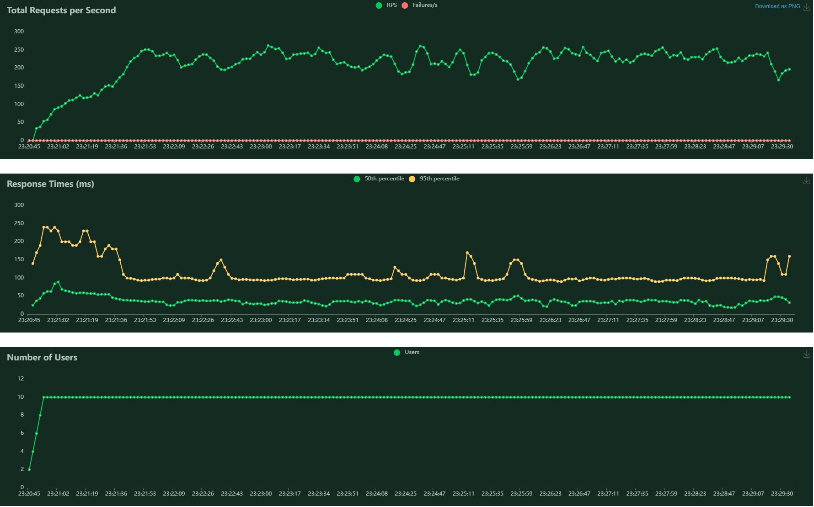
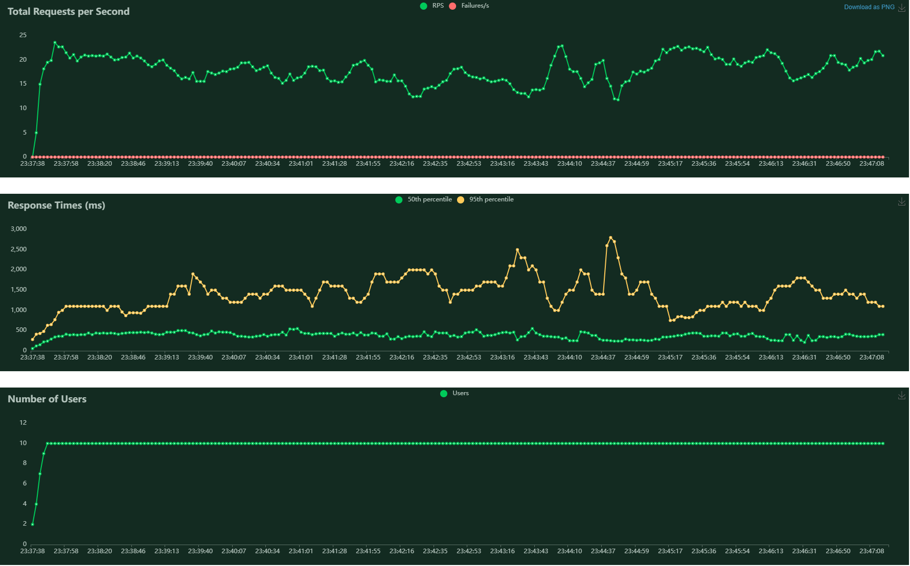
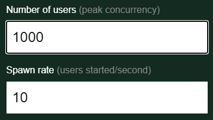
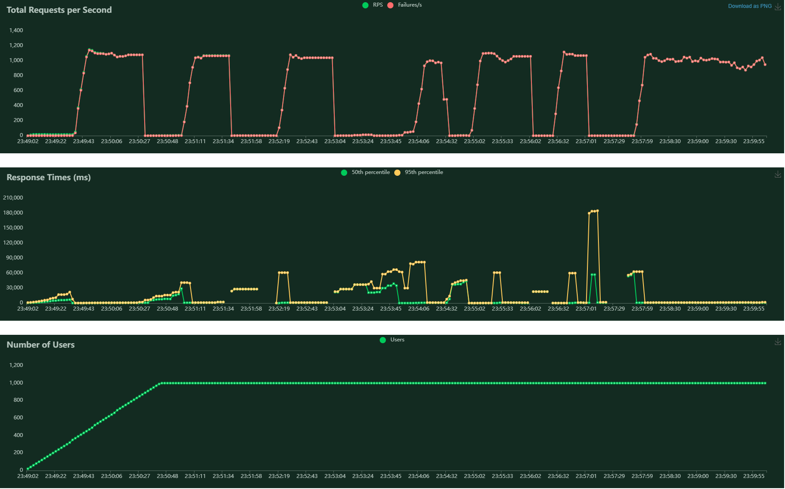
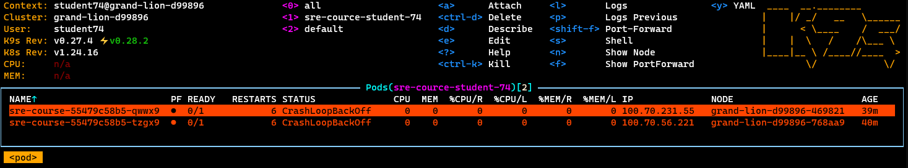
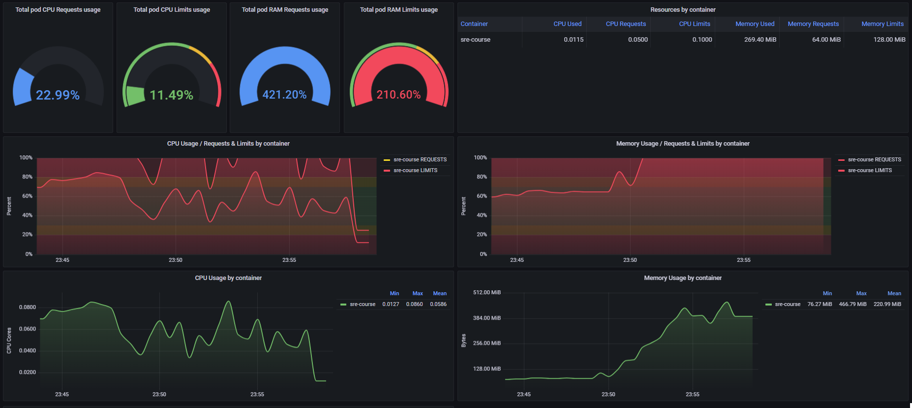
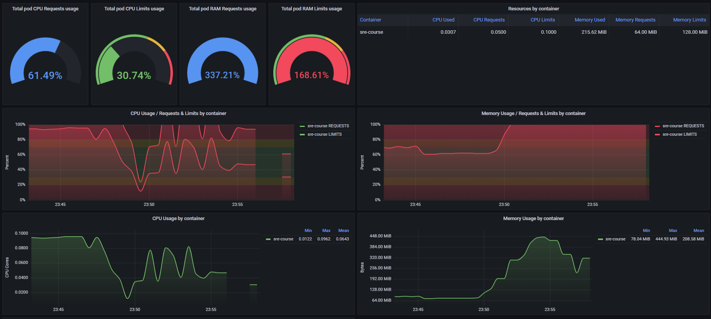

# ДОМАШНЕЕ ЗАДАНИЕ №3

```
namespace: sre-cource-student-74
user: student74
```
## Структура проекта

test_01.py, test_02.py - скрипты для тестов  
img/\* - скрины

# Подготовка для тестов

## Наполнение базы данных 
В таблицу cities были добавлены около 1210 городов России (Информация взята с https://simplemaps.com/data/world-cities)  
В таблицу forecast внесены по два прогноза на каждый id города 

## Выбор инструмента
Для тестов был выбран инстурмент locust, т.к. показался для меня самым простым в запуске, и я знаком с python.  
 

## Разработать профиль нагрузки для системы

### Для нагрузки системы я буду использовать два профиля:

- test_01. Запрос погоды пользователем  
Тип: GET 
API: HTTP://serverIP/Forecast/{ID}  
ID - random (в пределах)  
Время теста ~10мин  

Требования:  
не менее 100RPS  
задержка < 250мс  

Параметры запуска:  
  

Запуск теста:
``` locust -f test_01.py --host=http://serverIP  ```

Рестартов подов и ошибок не наблюдалось:  

  

Графики:  

 


- test_02. Запрос всех записей о погоде  
Предоположительно данный тип запроса будет использоваться реже, он имеет большой вывод, поэтому требования к нему мягче.  

Тип: GET 
API: HTTP://serverIP/Forecast  
Время теста ~10мин  

Требования:  
не менее 20RPS  
задержка < 400мс  

Параметры запуска:  
  

Запуск теста:
``` locust -f test_02.py --host=http://serverIP  ```

Рестартов подов и ошибок не наблюдалось:  

 

Графики:  

 


## Максимальная производительность системы  

Для определения максимальной нагрузки был выбран второй тест с увеличенным количетвом пользователей:  

Параметры запуска:  
  

Графики locust показывают, что rps поднимается до 1000, около 1-2 мин держится и потом поды уходят в перезагрузку. Всего 6 таких циклов.  

  

Это можем наблюдать и на панели k9s(6 рестартов):  

  

На мониторинге мы так же можем наблюдать всплески расхода ресурсов, в частности - оперативной памяти:

 


 


## Вывод  

Наблюдения показали следующее: при возрастании нагрузки увеличивается использжование оперативной памяти. При разворачивании проекта я указал следующие параметры:

```
resources:
  limits:
    cpu: 100m
    memory: 128Mi
  requests:
    cpu: 50m
    memory: 64Mi
```

Для обеспечения более стабильной работы системы необходимо увеличить количество подов, либо увеличить им границы потребляемых ресурсов. Максимальная производительность системы ~1000 RPS 
